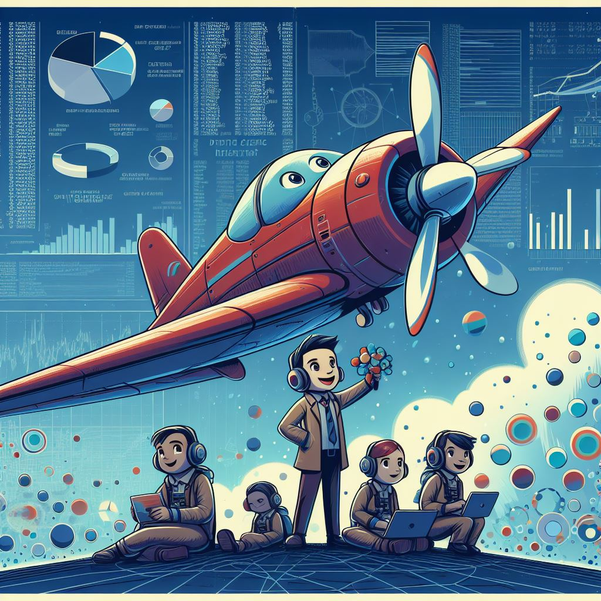

{height="400" fig-align="center"}

This website accompanies the non-competitive hackathon (funathon) organized by work package 6 within the AIML4OS project.

## What is a Funathon?

A funathon is a special sort of event, halfway between a training session and a hackathon. It aims at giving statisticians an opportunity to __learn and apply machine learning and IA methods in a collaborative and supportive environment__. Importantly, the funathon is a __non-competitive event__: the only goal is to learn and have fun.

Over two days, participants will work on ML and AI projects provided by the organizers. These projects are well-suited for beginners, have minimal technical requirements and contain detailed solutions so that no one is stuck. Throughout the event, the organizing team will be available to answer questions and support participants whenever needed.All projects will be carried out on the (amazing) SSPCloud platform. 

## 

## Déroulement de l'événement

L'événement dure 2 jours, les __25 et 26 juin__. En autonomie par équipe, vous bénéficierez tout de même pendant la durée de cet événement de canaux de communication avec les organisateurs (Zoom et Tchap) ouverts pour éviter tout blocage ou pour poser des questions de compréhension. 

En amont de l'événement, une présentation de l'événement, des sujets et de l'environnement de travail (le SSPCloud) aura lieu le __18 juin, 15h-17h__. 

A l'issue de l'événement, tout le contenu ici présent restera disponible. 

## Participer

L'ensemble des contenus de cet événement est disponible de manière libre, pendant l'événement mais aussi à l'issue de celui-ci.

Il est possible de participer:

* En s'inscrivant de manière formelle, par le biais de [SIFOR](https://formation.insee.fr/) pour les agents Insee ou
par l'intermédiaire des référents formations pour les agents des services statistiques ministériels ;
* En participant de manière informelle, sans inscription.

