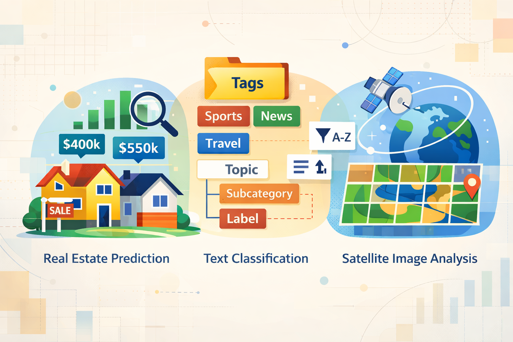

<!-- {height="400" fig-align="center"} -->

The 2026 funathon will take place on __May 27th and 28th__. If you want to register, see [here](/about.qmd).

<!--  

::: {#sample-listings}
:::

  -->

All resources developed for the funathon are available on the [`Github AIML4OS`](https://github.com/orgs/AIML4OS/teams/wp6-funathon/repositories) webpage.
